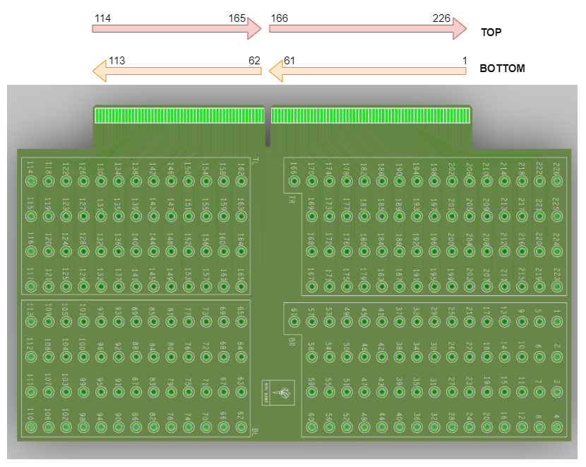
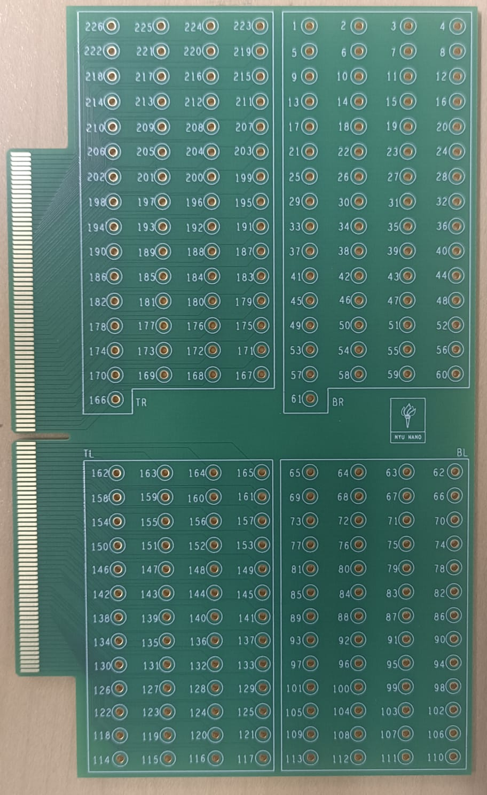
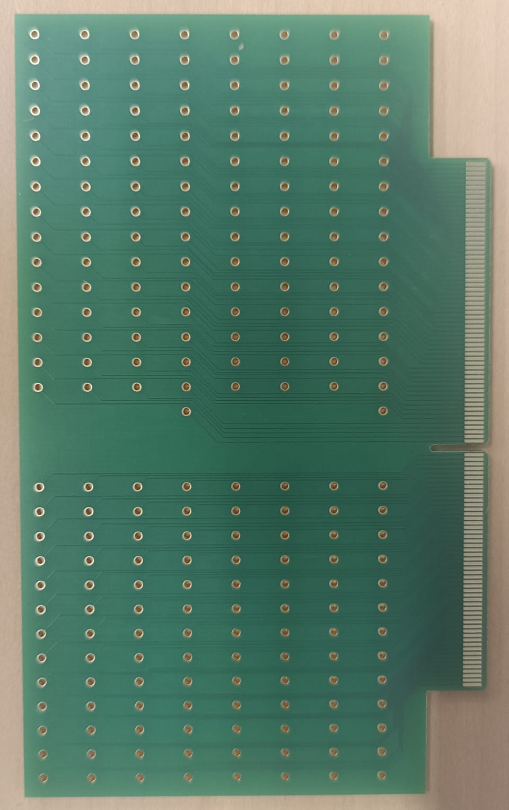

# Card Edge Connector Testing Board

## DNA Chip Carrier Testing Board

### Introduction

The 2 layer PCB board is designed to test the output of a card edge connector. It features 226 testing points that are connected to the 226 pads on the edge connector. The designed 3D view of the board along with pin numbering is as shown below. 
There are 226 testing points. Each testing point is 1.5mm wide with a hole diameter of 1mm. This is created using Orcad Padstack Editor.

The manufactured board is displayed below.

  
  

  <em>a): Board Top View</em> &emsp; <em>b): Board Bottom View</em>

